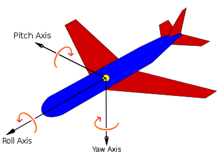
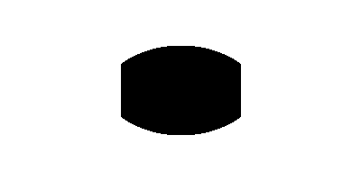

# viewport_handler
A handler for 360° video viewport. The coordinate system is called the Body Coordinate System and is the same used in aircraft.
Angles are in degrees. Positive values rotate the shaft counterclockwise.

## Description

The viewport is a region of sphere created by the intersection of
four planes that pass by center of sphere and the Field of view angles.
Each plane split the sphere in two hemispheres and consider the viewport
overlap.

Each plane was make using a normal vectors ($ \vec{N} = x_1 \hat{i} + y_1 \hat{j} + z_1 \hat{k} $) and the
equation of the plane ($ x_1 x + y_2 y + z_1 z = 0 $).
So, if we rotate the vectors, so the viewport is roted too.

## Depends:

- Python 3.8
- Numpy 1.20
- OpenCV 4.0

## Instructions

Create a viewport with specified field-of-view

    viewport = Viewport(Fov(x=120, y=90))

Set a position on sphere

    viewport.set_position(Point_bcs(yaw=0, pitch=0, roll=0))

Create a image array

    viewport.project('400x200')

Show

    viewport.show()

Or save

    viewport.save('viewport.png')

Examples:

Yaw=0, Pitch=0, Roll=0

Yaw=60, Pitch=45, Roll=10

